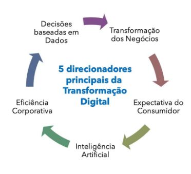

# IF989 - Tendências e Desafios em Sistemas de Informação

1 - Debate sobre artigos (previsões para 2022)

2 - Seminário GARTET 2023 (todo ano o gartnet apresenta 10 tendencias)

3 - Revisão sistemática (Planilha de 7 pontos) (Mostrar evidências)

Business Transformation - mudança da organização (como ela faz os processos e seu modelo de negócio)

- Ver as tendências baseada nos 3 pilares de SI (Tecnologia + processos + Pessoas)

  1 parte (Pesquisa ADROC)(informal) - relatório GARTET 2023
  
  1 parte pesquisa científica

--------------------------------------------------------------------

### Transformação Digital

5 chaves para a transformação digital hoje em dia

Fonte: CIO.com
https://www.cio.com/article/3198121/whats-now-in-digital-transformation.html

Motivação

“Foco central na Inteligência Artificial (IA) em todos os setores e uma necessidade de uma abordagem ainda mais agressiva à transformação digital para poder competir.”

### Alta Expectativa do consumidor

"Crescente personalização de produtos e serviços para atender à expectativa do consumidor"

“Cada vez que um consumidor é exposto a uma experiência digital aprimorada, suas expectativas são imediatamente redefinidas para um novo nível superior.” Brendan Witcher, analista da Forrester

Cliente: Inovação, Qualidade, Agilidade, Valor

### Inteligência Artificial

- A IA está na frente e no centro dos negócios

“Se você não tiver uma estratégia de IA, você vai morrer no mundo que está por vir." eBay CEO Devin Wenig

### Eficiência Corporativa

"Não é mais o grande vencendo o pequeno, mas o ágil vencendor o lento"

- Capacidade de ater-se ao necessário, tornou-se decisivo para a sobrevivência da empresas

### Decisões baseadas em dados

- A percepção do cliente continua sendo essencial

"Os dados devem ter a última voz na mesa".

"A transformação digital é uma mudança fundamental em como uma empresa entrega valor e gera receita."

### Business Tranformation 

•A transformação digital envolve inovações em sistemas, processos organizacionais e modelos de negócio.

