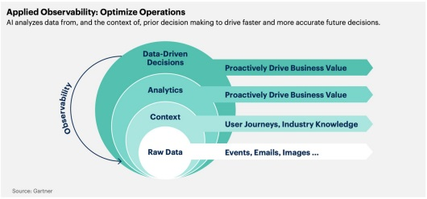
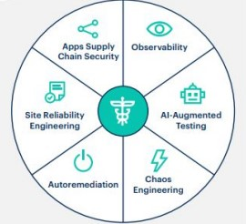

Primeira rodada de seminários:

## Digital Immune System:

### O que é Digital Immune System?

```
De acordo com Check Point 2023 Security Report, ataques cibernéticos
cresceram em 38% em 2022 comparado com o ano anterior, com uma média
de 1,168 ataques por semana.
```

“Digital Immune System (DIS), é um conjunto de tecnologias e processos que
ajudam uma organização a proteger seus dados e sistemas contra ataques e
vulnerabilidades” PERRI, 2022

detectar as atividades suspeitas
identificar em tempo real 
neutralizar a ameaça

São um conjuntos de práticas que vão desdo desing até a manutenção da aplicação.

O sistema imunológico mais robusto, proteje o sistema digital contra qualquer tipo de anomalias, ataques e deixa a recuperação do serviço mais rápida caso ele venha cair.
Ele reduz o risco do sistema cair e caso ele venha cair, o serviço está montado de um jeito que faz ele voltar ao ar mais rápido.

Quantos aspectos deve ser observados para alcançar um tipo de imunidade. Vai de pessoas (treinamento,capacitação) até mundança de processos. É uma observação contínua e tem que observar tudo o tempo inteiro. Incluse o uso da inteligência artificial para ajudar no monitoramento.
Algo muito relevante na empresa com sistemas altamente críticos. Empresas aéreas, bancos...

### Principais Stakeholders da área

● Organizações (organizações que tentam desenvolver aplicações mais resilientes para melhorar a satisfação dos usuários)

● Desenvolvedores e designers (responsáveis por implementar as práticas e os designesrs que fazem o fluxo mais fechado para usuários terem uma nevegação melhor)

● Equipes de segurança (vão indentificar as possíveis ameaças e tentar proteger o sistemas contra os tipos de ameças)

● Gerentes de TI (guiando as estratégias, gerenciando os recursos para imunisação do sistema)

● Usuários (destinatários finais, por conta deles está envolvido a melhoria contínua do sistema)


### Tecnologias Envolvidas

As tecnologias trabalham juntas: bloquear, isolar, remover ameaças. E fazer qualquer condição de segurança necessaria. Ingloba práticas tanto no desenvolvimento, no design, na automação...

● Hardware e softwares
● Firewalls
● Criptografia
● Monitoramento de rede e tráfego
● Sistemas de detecção e prevenção de intrusões (IDS/IPS)
● Inteligência artificial e aprendizado de máquina

### Mudanças nos processos de negócios e organizações

muitas não são coisas muito inovadoras, porém não são tão dinfudidas e muitas vezes as empresas não se preocupam tanto com isso. Quando se preocupa com uma acabam negligenciando a outra.

● Implementação de políticas e treinamento de segurança
● Monitoramento constante e análise de ameaças
● Tecnologias e práticas para experiência do usuário melhorada (caso o sistema venha cair fique o menor tempo o possível)
● Fortalecimento de sistemas e proteção contra falhas
● Resposta rápida a incidentes e atualizações de segurança

### Casos de uso
```
Banco Itaú

Implementou o conceito da Auto Remediação para monitorar a saúde
dos seus sistemas em busca de uma melhora contínua na qualidade dos
seus serviços. Tendo um aumento de 37% em soluções automatizadas e
diminuindo seu tempo de resolução de problemas em 45%.

Gartner 2023
```
Muitas atividades foram automatizadas.

https://www.youtube.com/watch?v=wup0DCIluvc (3:35 - 6:02)

Como a observability é importante

A observação dos dados trouse muito sucesso. Para entender o input e output dos dados.

### Digital Immune Systems se relaciona com Tecnologia Sustentável?

Use Case: Klaveness Ship Management

usaram da inteligencia artificial para fazer automação da gerencia de dados. Que ajudou a tomar decisões mais rápidas.



Também é usado na agricutura. Para ter melhor usabilidade dos dados

### Principais Desafios

É uma prática de funciona melhor em modelos de negócios mais estáveis e com menos incertesas. Em startups é muito difícil implementar pois não existe muitas certesas.

Outra grande desesafio é a grande quantidade de dados. Que fica difícil intender quais os dados são realmente importantes para os objetivos.

● Ambiente de incertezas
● Manutenção
● Grande quantidade de dados
● Vulnerabilidades
● Dependências de terceiros

Grande problema de distribuir as responsabilidades para terceiros, esses terceiros tem responsabilidadades distribuidas para software de terceiros também que acaba caindo em uma cadeia de responsabilidade. É preciso escolher um softwere de terceiro bem qualificado para não afetar o sistema.



### Conclusões

Digital Immune System (DIS) vem sendo fundamental para o funcionamento das organizações no cenário atual de mercado. Melhorando a experiência do consumidor pela construção de um sistema seguro e automatizado, sendo mais resistente a falhas.

Referências:

● https://www.gartner.com/en/articles/what-is-a-digital-immune-system-and-why-does-it-matter
● https://www.gartner.com/en/articles/what-is-a-digital-immune-system-and-why-does-it-matter
● Gartner’s Top 10 Tech Trends for 2023 | Gartner IT Symposium/XPO Full Keynote

Segurança é um tema que sempre estará em enfase
A única certesa que tem é que não existe segurança 100%

Alguns temas que poderiam ser visto na sergunda parte da disciplina
- Ataques a sistemas da web e soluções a esses, um panorama dos ultimos 5 anos (quais as tecnologias...)
verificar as informações de mercado (relatório do Gartner) com as informações científicas
- elementos envolvidos pelo sistema digital imuno (atores, processo e tecnologia) (o que é o sistema digital imuno?)
- Desafios na construção nos sistema digitais imuno, um panoram dos ultimos 5 anos

## Metaverso

### O que é Metaverso?

Definição 1: A nova camada da realidade que integra o mundo real e o virtual

Definição 2: Um ambiente virtual coletivo que as pessoas possam interagir entre si e com marcas

Esse termo já surgiu a mais de 30 anos. Em 1902 quando Bill Dirson escreveu o termo no livro slow crash e apareceu novamente no romance webplay1 em 2000.

Houveram algumas tentativas de criar o metarverso uma delas foi o Second life. Mas ele não conseguiu interagir o mundo real e o mundo real.

### Principais Stakeholders da área

- BigTechs (que foram as maiores entusiastas nessa tecnologia): Meta (antigo facebook)
- Desenvolvedores e criadores de conteúdo. (vão implementar, criar, alimentar experiências no ambiente do metaverso)
- Usuários e comunidades (as pessoas que participam e interagem com o ambiente)
- Marcas (oportunidade de negócio no ambiente virtual)
- Sociedade (atuar na regulamentação)

A idéia seria diminuir a barreira entre os usuários e as máquinas. QUe o usuário podesse viver virtualmente uma experiência de compra tão completa quanto seria uma experiência no mundo real. 

E no futuro que o metaverso estaria impactando a sociedade. 

### Mudanças nos processos de negócios e organizações

- Experiência com as marcas, experiência imerciva
- Publicidade e Marketing com marcas (criar campanhas publicitárias dentro desses ambientes)
- Colaboração e trabalho remoto
- Perda e oferta de serviços
- A inovação e criação de conteúdo (liberdade criativa ilimitada)

### Tecnologias Envolvidas

- Realidade Virtual (experiência imercivas)
- Realidade Aumentada (adiciona camada entre o mundo virtual e físico)
- blockchain, criptomoedas e NFT (moedas usadas para criar economia virtual)

### Metaverso se relaciona com Tecnologia Sustentável?

- Infraestrutura verde. (o centro de processamento usando energias renováveis)
- Redução de deslocamento (redução de impacto de gases de transporte)
- Consumo virtual (reduz a produçã de vários ninchos... uso de papel, ambalagens, nota fiscal...)(a unificação das marcas no ambiente virutla e a relação fluida do cliente com a marca seira facilitado.
- educação e consientização ambiental
- inovação e colaboração sustentável (novas estratégias e novos modelos de negócio

### Casos de uso

Meta

Não é um case de sucesso. Todo investimento não foi bom
o facebook tentou desenvolver aplicativos.

Quanado existe o hype de uma tecnologia lá na frente vai encontrar desafios para tonar a tecnologia acessível para um público

Tecnologia muito caro

A maneira de como era vendido o metaverso era como se tudo seria fluido e rápido. Mas na prática não era assim.

IOT não está disponível na casa de qualquer pessoa de classe média.

a evolução da tecnologia não está acompanhando as idéias do dono do facebook

### Principais Desafios

- Quais eram as possibilidades do metaverso?
- Difícil encontrar direcionamento. Na realidade as pessoas não usam da forma que é idealizado para usar o app.
- Todos os desafios encontrados não trouze uma boa avaliação dos investidores
- As outras empresas não estão focadas em RV mas sim em AI.

- Fata de infraestrutra tecnológica (cara e de difício acessO)
- as ferramentas que existe hoja não são o suficiente para acompanhar a idéia que foi idealizada do metaverso
- Não tem como fazer a Interação com outros metaversos de outras empresas (os ambientes virtuais de outras empresas são complementamentes independêntes. Desafio de definir os padrões que cada metaverso vai ter.
- Privacidade e segurança. Os problemas que sem tem nas redes sociais será amplificada ao máximo.
- Problema na adoção e compreenção dos benefícios e propostas de valor da tecnologia.
- 
58:00

● Conclusões


